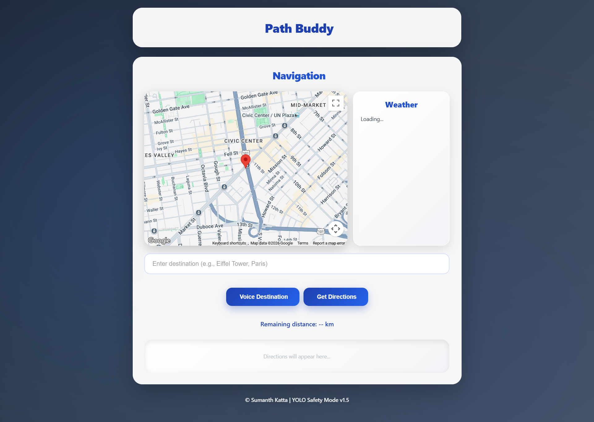

# BlindMate - Path Buddy 👁️🗺️


> **Hackathon Project (IARE):** A real-time object detection and navigation assistance system designed to empower visually impaired users with "digital sight."

## 🖼️ Project Preview

*(Snapshot of the real-time detection interface with risk classification)*

## 💡 The Problem & Solution
* **The Challenge:** Visually impaired individuals face constant risks from moving vehicles, obstacles, and navigation uncertainty.
* **Our Solution:** An AI-powered "Third Eye" that uses computer vision to detect objects, classify their risk level (High/Medium/Low), and provide audio turn-by-turn navigation.

---

## 🌟 Key Features

### 🎯 intelligent Object Detection (YOLOv8)
The system processes video feeds in real-time to identify and classify obstacles:
* **🔴 High Risk:** Cars, Buses, Trucks, Motorbikes (Triggers urgent alerts).
* **🟡 Medium Risk:** People, Animals (Dogs, Cats, Cows).
* **🟢 Low Risk:** Static objects / General obstacles.
* **Spatial Awareness:** Announces if the object is to the **Left, Center, or Right** and estimates distance (1m, 2m, 3m+).

### 🗺️ Voice-Guided Navigation
* **"Casual Walk" Mode:** For roaming without a set destination (exploring).
* **Navigation Mode:** Full Google Maps integration with voice destination input.
* **Live Context:** Updates user on current weather and exact location.

### 🔊 Accessibility Suite
* **Text-to-Speech (TTS):** Reads out all detections and directions clearly.
* **Beep Alerts:** Distinct warning sounds for high-risk threats.
* **High-Contrast UI:** Designed with large visual indicators for users with partial vision.

---

## 🛠️ Tech Stack
* **Frontend:** HTML5, CSS3 (Glassmorphism UI), JavaScript.
* **Backend:** Python **FastAPI** (High-performance async server).
* **AI/ML Engine:** **YOLOv8** (Ultralytics) for object detection, **OpenCV** for image processing.
* **APIs:** Google Maps API (Nav), Web Speech API (Voice Control), OpenWeather API.

## 🚀 How to Run Locally

### 1. Backend Setup
```bash
# Install dependencies
pip install fastapi uvicorn ultralytics opencv-python numpy python-multipart

# Run the server
uvicorn backend:app --reload --host 127.0.0.1 --port 8000
